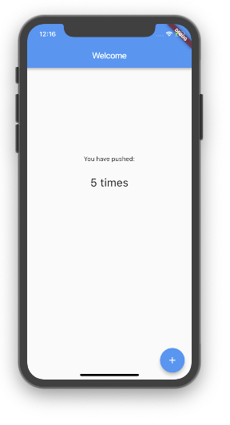
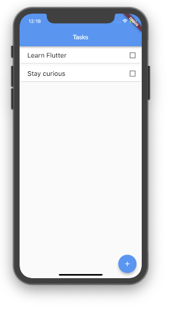

# Examples

Examples can help to show some good patterns for creating elegant apps. These are currently available:

### [Testdrive](https://github.com/flutter-view/examples/tree/master/testdrive)

This is the **getting started project** as explained in the[ test drive chapter](test-drive.md) of the documentation. It shows a simple hello world using pug and sass.

### [Counter](https://github.com/flutter-view/examples/tree/master/counter)

A flutter-view version of the Flutter starter project. It uses the **reactive** tag and the [flutter-view-tools library ](https://pub.dartlang.org/packages/flutter_view_tools)for responding and updating the count.

Instead of having the counter state in the widgets, it is kept in the application model, and the HomePage flutter-view listenes to the model and updates itself when the user presses the + button.

### [Todolist](https://github.com/flutter-view/examples/tree/master/todolist)

An example of how you can build a simple todo app using flutter-view and the [flutter-view-tools library](https://pub.dartlang.org/packages/flutter_view_tools). It separates the app model from the page model. This is a structure that can scale as your app grows and you add more pages. The [Writing Reactive code](../guide/writing-reactive-code.md) chapter builds this app step by step.

