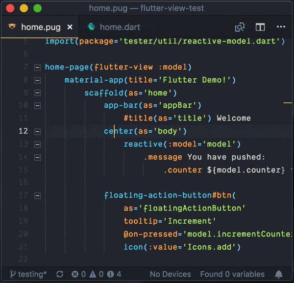

# VS Code support

You can use flutter-view with any IDE. However for Visual Studio Code users there are tools to make life more convenient.

## Linking between Pug and generated Dart



Enabling linking between Pug and Dart will make it easier to see the effects of your changes. To get this functionality in VSCode, install the following two extensions:

* the [**flutter-view extension**](https://marketplace.visualstudio.com/items?itemName=blueneogeo.flutter-view-vscode) lets you link from Pug to generated Dart
* the [**project-links extension**](https://marketplace.visualstudio.com/items?itemName=KyleDavidE.vscode-project-links) lets you link from links in the generated Dart to the source Pug

_Note: for this to work, the project link comments in flutter-view must be enabled (default is on)_

## Enabling hot refresh for Pug and Sass files

Normally when you change Flutter Dart code in VSCode, the Dart extension knows you are running a Flutter project and triggers a hot reload in your connected device or emulator.

When you change a Pug, Html, Sass or CSS file, flutter-view will update the Dart code in the background as you save. However the editor will not know that it needs to trigger a hot reload.

To enable this, we need to do two things:

1. install the [save and run ext](https://github.com/padjon/vscode-save-and-run-ext) extension that lets us trigger commands on events on saving
2. add the commands to hot-reload when the files are saved.

### Adding the hot reload commands

After installing the extension, press `cmd+shift+P` to open the command palette in VSCode and pick the **Preferences: Open Settings (JSON)** command to open your settings.

In the **JSON settings** under either _Workspace settings_ or _User settings_, add the following extra configuration:

```javascript
"saveAndRunExt": {
        "commands": [
            {
                "match": ".pug",
                "isShellCommand" : false,
                "cmd": "flutter.hotReload"
            },
            {
                "match": ".sass",
                "isShellCommand" : false,
                "cmd": "flutter.hotReload"
            },
            {
                "match": ".css",
                "isShellCommand" : false,
                "cmd": "flutter.hotReload"
            },
            {
                "match": ".html",
                "isShellCommand" : false,
                "cmd": "flutter.hotReload"
            },
            {
                "match": ".htm",
                "isShellCommand" : false,
                "cmd": "flutter.hotReload"
            }
        ]
    },
```

Your settings should like something like this:


Save your settings afterwards.

### Testing the hot reload

Now try opening the test drive project from the previous chapter (or your own flutter-view project) and run it in the emulator.

Changing the Pug or Sass and saving it should now automatically make the changes visible in your running application.

Congratulations, you are all ready to start making your flutter-view enabled Flutter app!
