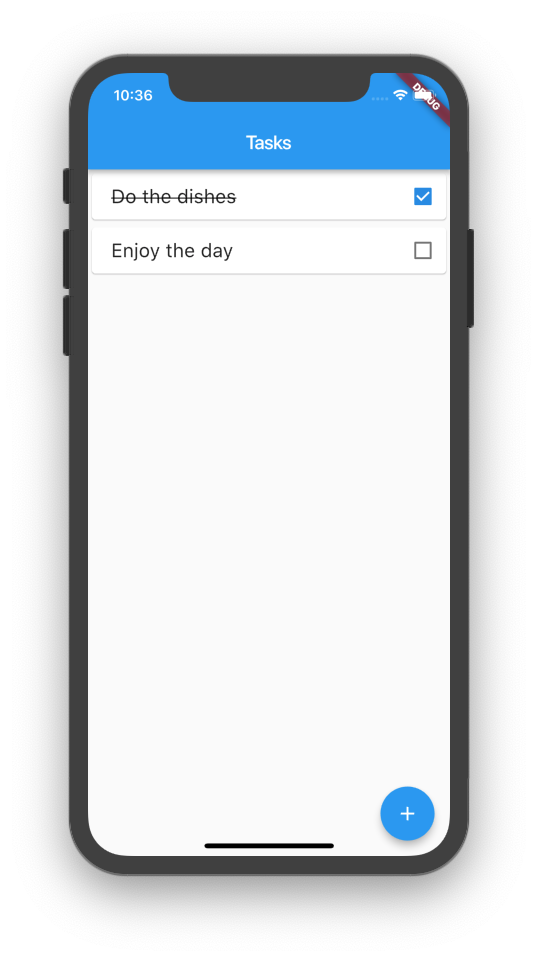

# Writing Reactive code

**Flutter leaves us with a lot of freedom in how we want to write reactive code. Flutter-view proposes a structure but does not impose it.**

This guide will show you how we recommend you build a simple reactive app with an [MVVM approach](https://en.wikipedia.org/wiki/Model–view–viewmodel) using the ReactiveWidget and flutter-view.

_Note: this approach requires you add the_ [_**flutter\_view\_tools**_](https://pub.dartlang.org/packages/flutter_view_tools) _dependency to your project's **pubspec.yaml** file._

## The basic structure

To write our MVVM Flutter app, we create a couple of elements:

* **the app model:** the top level app data class with application level actions
* **the business model**: through classes that the represent logical data in our app
* **the views**: layouts that present data
* **the view-models**: models classes that are coupled to the views, and represent the data the views will present, as well as handle events in the views, and communicate to the app

To make things clearer, we will write a simple todo app. For this app, we will need each of the above elements:

* **lib/main.dart**: the starting point of our app
* **lib/model/app-model.dart**: contains the AppModel class that models our app
* **lib/model/task.dart**: contains the Task class that models a single task
* **lib/pages/taskspage/taskspage.dart**: the view of the taskspage, that shows all our tasks
* **lib/pages/taskspage/taskspage-model.dart**: the view-model of our taskspage

## Creating the model

To create any model class, we extend the [**Model**](https://pub.dartlang.org/documentation/scoped_model/latest/scoped_model/Model-class.html) class from the [scoped model library](https://pub.dartlang.org/packages/scoped_model).

Our task has a name and can be done:



```dart
import 'package:meta/meta.dart';
import 'package:scoped_model/scoped_model.dart';

class Task extends Model {

  Task({@required this.name, this.done = false});

  String name;
  bool done;
}
```



Our application has a model that contains the list of tasks we want to keep:



```dart
import 'package:scoped_model/scoped_model.dart';
import 'package:todolist/model/task.dart';

class AppModel extends Model {
  AppModel() {
    this.tasks = [];
  }

  List<Task> tasks;
}
```



Both **Task** and **AppModel** extend [**Model**](https://pub.dartlang.org/documentation/scoped_model/latest/scoped_model/Model-class.html). This allows them to be listened to for updates. 

In any reactive app you want to be able to inform views to react to the data changing. The views can listen to the models by calling [**model.addListener\(\)**](https://pub.dartlang.org/documentation/scoped_model/latest/scoped_model/Model/addListener.html). You can then inform that data in a model has changed by calling [**model.notifyListeners\(\)**](https://pub.dartlang.org/documentation/scoped_model/latest/scoped_model/Model/notifyListeners.html).

## Creating a view

To present the app, we need two basic things:

* the view model, a class that represents what we want to show on the page and handles any events and has presentation code
* the view, which contains code that lays out the widgets that paint what we see

We want our app to look like this:



Our view model starts out simple, for now it only needs a reference to the app, so it can show the tasks we have:



```dart
import 'package:meta/meta.dart';
import 'package:scoped_model/scoped_model.dart';
import 'package:todolist/model/app-model.dart';

class TasksPageModel extends Model {
  TasksPageModel({@required this.app});

  final AppModel app;
}
```




