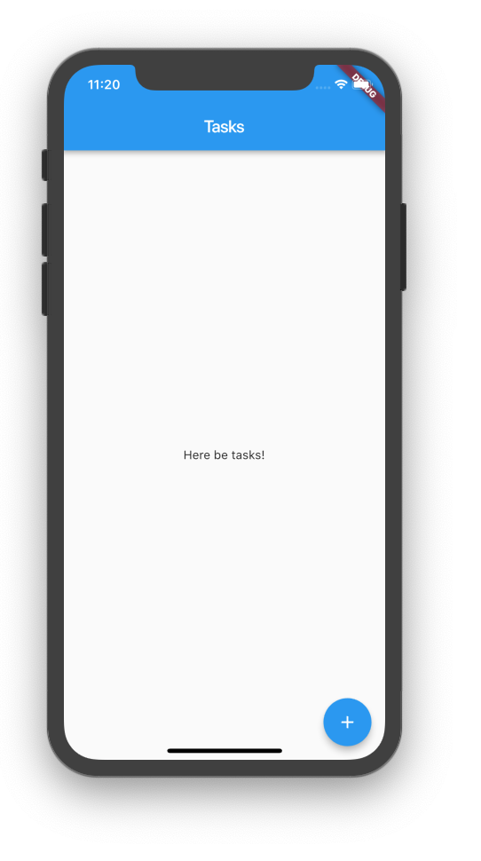
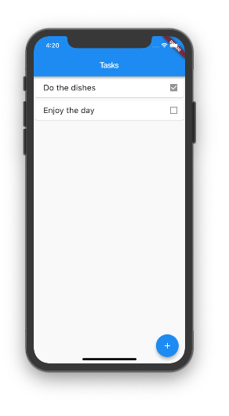
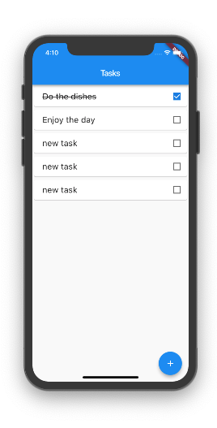

# Writing Reactive code

_Note: This example leverages the excellent_ [_**scoped\_model library**_](https://pub.dartlang.org/packages/scoped_model)_, which usage inspired the reactive pattern for flutter-view!_

**Flutter leaves us with a lot of freedom in how we want to write reactive code. Flutter-view proposes a structure but does not impose it.**

This guide will show you how we recommend you build a simple reactive app with an [MVVM approach](https://en.wikipedia.org/wiki/Model–view–viewmodel) using the ReactiveWidget and flutter-view. In essence building a reactive app in flutter-view always works the same:

1. **handle events from your views on the view-model**
2. **have the view-model call your business model for actions**
3. **have those actions update your business model data**
4. **have your views use the** [**reactive**](../reference/tag-shortcuts.md#reactive) **tag to listen for any updates**

Our app will look like this:


You can find the[ full app source code](https://github.com/flutter-view/examples/tree/master/todolist) with some extra features added such as deleting and persistence in [the examples](../get-started/examples.md#todolist).

_Note: this approach requires you add the_ [_**flutter\_view\_tools**_](https://pub.dartlang.org/packages/flutter_view_tools) _dependency to your project's **pubspec.yaml** file. It is also recommended to use VS Code with the_ [_**flutter-view extensions**_](../get-started/vs-code-support.md)_._

## The basic structure

To write our MVVM Flutter app, we create a couple of elements:

* **the app model:** the top level app data class with application level actions
* **the business model**: through classes that the represent logical data in our app
* **the views**: layouts that present data
* **the view-models**: models classes that are coupled to the views, and represent the data the views will present, as well as handle events in the views, and communicate to the app

To make things clearer, we will write a simple todo app. For this app, we will need each of the above elements:

* **lib/main.dart**: the starting point of our app
* **lib/model/app-model.dart**: contains the AppModel class that models our app
* **lib/model/task.dart**: contains the Task class that models a single task
* **lib/pages/taskspage/taskspage.dart**: the view of the taskspage, that shows all our tasks
* **lib/pages/taskspage/taskspage-model.dart**: the view-model of our taskspage

## Creating the business model

To create any model class, we extend the [**Model**](https://pub.dartlang.org/documentation/scoped_model/latest/scoped_model/Model-class.html) class from the [scoped model library](https://pub.dartlang.org/packages/scoped_model).

Our task has a name and can be done:



```dart
import 'package:meta/meta.dart';
import 'package:flutter_view_tools/flutter_view_tools.dart';

class Task extends Model {

  Task({@required this.name, this.done = false});

  String name;
  bool done;
}
```



Our application has a model that contains the list of tasks we want to keep:



```dart
import 'package:flutter_view_tools/flutter_view_tools.dart';
import 'package:todolist/model/task.dart';

class AppModel extends Model {
  AppModel() {
    this.tasks = [];
  }

  List<Task> tasks;
}
```



Both **Task** and **AppModel** extend [**Model**](https://pub.dartlang.org/documentation/scoped_model/latest/scoped_model/Model-class.html). This allows them to be listened to for updates. 

In any reactive app you want to be able to inform views to react to the data changing. The views can listen to the models by calling [**model.addListener\(\)**](https://pub.dartlang.org/documentation/scoped_model/latest/scoped_model/Model/addListener.html). You can then inform that data in a model has changed by calling [**model.notifyListeners\(\)**](https://pub.dartlang.org/documentation/scoped_model/latest/scoped_model/Model/notifyListeners.html).

## Creating a view and view-model

To present the app, we need two basic things:

* the view model, a class that represents what we want to show on the page and handles any events and has presentation code
* the view, which contains code that lays out the widgets that paint what we see

Our view model starts out simple, for now it only needs a reference to the app, so it can show the tasks we have:



```dart
import 'package:meta/meta.dart';
import 'package:flutter_view_tools/flutter_view_tools.dart';
import 'package:todolist/model/app-model.dart';

class TasksPageModel extends Model {
  TasksPageModel({@required this.app});

  final AppModel app;
}
```



Our view is a page scaffold with a list of tasks and a floating add button on the bottom right. In flutter-view, we can easily construct it using Pug:



```css
import(package='flutter_view_tools/flutter_view_tools.dart')
import(package='todolist/model/app-model.dart')
import(package='todolist/model/task.dart')
import(file='taskspage-model.dart')

tasks-page(flutter-view :model[TasksPageModel])
	builder
		scaffold
			app-bar(as='appBar')
				#title(as='title') Tasks
				
			#body(as='body')
				center Here be tasks!

			floating-action-button(as='floatingActionButton')
				icon(:value='Icons.add')
```



```dart
// note: __flatten, ignores and package links removed for clarity
import 'package:flutter/material.dart';
import 'package:flutter/cupertino.dart';
import 'package:flutter_view_tools/flutter_view_tools.dart';
import 'package:todolist/model/app-model.dart';
import 'package:todolist/model/task.dart';
import 'taskspage-model.dart';

Builder TasksPage({ @required TasksPageModel model }) {
  return Builder(
    builder: (context) {
      return Scaffold(
        appBar: AppBar(
          title: 
          //-- TITLE ----------------------------------------------------------
          Container(
            child: Text( 
              'Tasks',
            ),
          ),
        ),
        body: 
        //-- BODY ----------------------------------------------------------
        Container(
          child: Center(
            child: Text( 
              'Here be tasks!',
            ),
          ),
        ),
        floatingActionButton: FloatingActionButton(
          onPressed: () { model.onAddButtonPressed(context); },
          child: Icon(
            Icons.add,
          ),
        ),
      );
    },
  );
}
```



_Note: be sure to be running flutter-view -w lib in your project directory on a Terminal._

Saving taskspage.pug will trigger flutter-view to create taskspage.dart next to it.

In lines **1-4** we [**import**](creating-a-new-view.md#adding-imports) all the elements we use in our view: the flutter\_view\_tools library and all our models.

Line **6** tells flutter-view to create a new function that takes a TasksPageModel as a parameter, and returns our widgets.

At line **7** we start with a builder. This is a convenient way to get access to the **context** variable. We will need this later.

Line **8** creates the Scaffold of our page. It has three parts: an AppBar at line **9-10**, a body with a placeholder text at line **12-13** and a FloatingActionButton at like **15-16**. For now, we are not yet showing the tasks.

## Wiring up the app

To use the **AppModel**, **Task**, **TasksPage** and **TasksPageModel** we just created, we need to start the app from **main.dart.**

The top-level widget we create in **main.dart** should do the following:

* create our **AppModel** and keep it in its state
* start as home with our **TasksPage** and pass a **TasksPageModel**



```dart
import 'package:flutter/material.dart';
import 'package:todolist/model/app-model.dart';
import 'package:todolist/pages/taskspage/taskspage-model.dart';
import 'package:todolist/pages/taskspage/taskspage.dart';


void main() {
  runApp(TodoListApp());
}

class TodoListApp extends StatefulWidget {
  @override
  createState() => _TodoListAppState();
}

class _TodoListAppState extends State<TodoListApp> {
  /// The app contains a list of tasks and app-level functions
  AppModel app;

  @override
  void initState() {
    super.initState();
    app = AppModel();
  }

  @override
  build(context) => MaterialApp(
        title: 'Todo List',
        // we pass a new task page model into the page, with a reference to our app
        home: TasksPage(model: TasksPageModel(app: app)),
      );
}
```



At line **15** we create the state for our **TodoListApp.** It keeps the **AppModel** at line **17**. In the **initState\(\)** method, we initialize our **app**.

We create the **MaterialApp** at line **26**. At line **29** we call **TasksPage**, and we pass as the **model** parameter the **TasksPageModel** as our view-model. The view-model in turn takes the **app** as a parameter.

Now that we have wired up all the basic parts, we can run our app:



## Showing data from the model

Now that the basic framework is in place, **we can use flutter-view to present model data it in the view**.

In the case of our app, we want to show the tasks from the **AppModel** in our **tasks-page**. When there are no tasks, we want to show a message that encourages someone to create the first task. When there are already tasks, we want to show the list.

First lets set some example starter tasks. In **AppModel**, add some starter tasks:



```dart
// this.tasks = [];

this.tasks = [
  Task(name: 'Do the dishes', done: true),
  Task(name: 'Enjoy the day', done: false),
];

```



To actually show the tasks on the **tasks-page**, we can iterate through them with the flutter-view [**for property**](flow-control.md#for)**:**



```c
// #body(as='body')
//    center Here be tasks!

#body(as='body')
    list-view
        .task(for='task in model.app.tasks') ${task.name}
```



Now after hot reloading you should see the two tasks, as two lines of text. 

In line 5, we are creating an array of .task Containers, one for each element in **TaskPageModel.app.tasks.** In each container we put a text with the task name.

To clean up the presentation a bit, we can create a view that creates a single task, and repeat that instread. Add the following flutter-view code in **tasks-page.pug**:



```css
task-entry(flutter-view :task[Task] :model[TasksPageModel])
	card
		row
			.title ${task.name}
			checkbox(:^value='task.done')
```



This renders a single task entry. 

_Note the **value** property in the checkbox tag. It needs to be escaped because value is a reserved flutter-view keyword, used to pass an unnamed parameter._

Now we can use it in the body:



```css
#body(as='body')
    list-view
        task-entry(for='task in model.app.tasks' :task='task' :model='model')
```



In line 3, we are again using for to repeat the tag for each task. A **task-entry** takes two parameters: the task and the model, so we pass both.

Finally, let's add some styling. Create a tasks-page.sass next to tasks-page.pug, and put in the following styling:



```css
task-entry
	card
		row
			main-axis-alignment: space-between
			.title
				margin-left: 20
				font-size: 20
```



Please compare this sass styling with the pug task-entry we added. The Row in task-entry gets assigned a space between main-axis-alignment, which pushes the text to the left and the checkbox to the right. Besides that we set a font size and margin to the **.title** Container.

See the generated task-page.dart to see what actually is being generated in Dart, by taking the Pug  and applying the styles with shortcuts. The result looks like this:



## Making the view reactive

**To make a view react to changes in your model, use the** [**reactive tag**](../reference/tag-shortcuts.md#reactive)**.**

Now let us create a new task entry with the text "new task" whenever the user presses the + button. This requires the following steps:

1. listen to the event of the user pressing the button
2. handle the event in the view-model, asking the AppModel for a new task
3. have the AppModel create the new task
4. make the page-view react to changes to the AppModel.tasks

### Listening to the event of the user pressing the button

The + button is defined in tasks-page.pug. Change the code for the floating-action-button like this:



```css
floating-action-button(
    as='floatingActionButton'
    @on-pressed='model.onAddButtonPressed(context)')
    icon(:value='Icons.add')
```



The **@on-pressed** event handler is new. It calls **TasksPageModel.onAddButtonPressed\(\)** with the current BuildContext. We need to create this method on **TasksPageModel.**

### **Handle the event in the view-model**

We want the view-model to ask the app to create a new task. Add the following code to **TasksPageModel** in tasks-page-model.dart:



```dart
onAddButtonPressed(BuildContext context) {
    this.app.addTask(title: "new task");
}
```



### Have the AppModel create the new task

Now to create the new task in the AppModel, we need to create a task and add it to the list of tasks. Add the following code to **AppModel** in app-model.dart:



```dart
addTask({String title}) {
  final task = Task(name: title);
  this.tasks.add(task);
  this.notifyListeners();
}
```



In line **2** we create the new task. We then add it. Finally and importantly, we need to call **notifyListeners\(\)** on the AppModel. This will inform the interface to respond to the new task being added.

### Make the page-view react to changes to the AppModel.tasks

To make page-view react to changes of the **AppModel**, we need to watch the **AppModel** using the **reactive tag**. Since we pass the **AppModel** to the **TasksPageModel**, we can use model.app to get a reference to the **AppModel.** Update the tasks-page body again:



```css
// #body(as='body')

reactive(as='body' watch='model.app')
    list-view
        task-entry(for='task in model.app.tasks' :task='task' :model='model')
```



The only real replacement is that we changed a simple \#body container into a reactive tag, that watches the app for changes. When the **notifyListeners\(\)** call is made on the **AppModel**, everything below the reactive tag is reevaluated. Thus when we add a new task, it should now show in the view:


## Using computed properties

Often you may need to calculate things for your presentation that are not possible with just simple layout presentation logic. Instead **you use the view-model to compute values for your view**.

For example, let's have the tasks that are completed have their title text decorated with strike-through. And as an exercise, let's have the text-decoration computed on the view-model instead of in the view. Update the task-entry in tasks-page.pug:



```css
task-entry(flutter-view :task[Task] :model[TasksPageModel])
	card
		row
			.title(:text-decoration='model.taskTextDecoration(task)')
				| ${task.name}
			checkbox(:^value='task.done')
```



At line 4 we have added a computed [**text-decoration**](../reference/css-properties.md#box-shadow-13) property. It starts with `:` so it will use the result of the expression we pass. This expression is **model.taskTextDecoration\(task\)**. We want this expression to return [**TextDecoration.lineThrough**](https://docs.flutter.io/flutter/dart-ui/TextDecoration/lineThrough-constant.html) if our passed current task is done. Let's add this method to the **TasksPageModel**:



```dart
import 'package:meta/meta.dart';
import 'package:flutter_view_tools/flutter_view_tools.dart';
import 'package:todolist/model/app-model.dart';

class TasksPageModel extends Model {
  TasksPageModel({@required this.app});

  final AppModel app;
  
  taskTextDecoration(Task task) {
    return task.done ? TextDecoration.lineThrough : TextDecoration.none;
  }
}
```



Now completed tasks look more completed:



## Monitoring the state lifecycle

You may need to _**initialize**_ some things in your **view-model** when the state of your layout starts, and _**free**_ those resources when the state is disposed of. In that case, **use a** [**lifecycle**](../reference/tag-shortcuts.md#lifecycle) **widget**. It is part of the flutter-view-tools library. 

For example, let's say your **view** has a [**ListView**](https://docs.flutter.io/flutter/widgets/ListView-class.html) widget with a long list and you want to be able to load more items when you scroll near the bottom.

This requires we create a [**ScrollController**](https://docs.flutter.io/flutter/widgets/ScrollController-class.html) in the **view-model** and pass it to the [**ListView**](https://docs.flutter.io/flutter/widgets/ListView-class.html) ****in the **view**. We can then listen to the [**ScrollController**](https://docs.flutter.io/flutter/widgets/ScrollController-class.html) and react when the scrollposition is very low. Finally, when the **view** is disposed of, we also want our listener to be removed.

In the todo app we can do this as follows in the **view**: 



```css
#body(as='body')
    lifecycle(:on-init='model.init' :on-dispose='model.dispose')
        list-view(:controller='model.scrollController')
            task-entry(for='task in model.app.tasks' :task='task' :model='model')
```



At line **2** we add the [**lifecycle**](../reference/tag-shortcuts.md#lifecycle) widget with handlers for the init and dispose events, and pass them along to the **view-model**. 

At line **3** we pass the scrollController of the view-model to the list, so we can monitor the scrolling position.

The **view-model** needs to store the scrollController, initialize it and dispose of it:



```dart
import 'package:meta/meta.dart';
import 'package:flutter/widgets.dart'
import 'package:flutter_view_tools/flutter_view_tools.dart';
import 'package:todolist/model/app-model.dart';

class TasksPageModel extends Model {
  TasksPageModel({@required this.app})
    : scrollController = ScrollController(initialScrollOffset: 0.0, keepScrollOffset: true);

  final AppModel app;
  final flutter.ScrollController scrollController;

  init() {
    this.scrollController.addListener(this.onScroll)
  }
  
  dispose() {
    this.scrollController.removeListener(this.onScroll)
  }
  
  onScroll() {
    if (this.scrollController.position.extentAfter < 500) {
      // if not already loading, load more entries here!
    }
  }
      
  taskTextDecoration(Task task) {
    return task.done ? TextDecoration.lineThrough : TextDecoration.none;
  }
}
```



At line 8 the **scrollController** is set up.

At lines **13** and **17** we add the **init** and **dispose** methods that are called by the lifecycle widget. These will start and stop listening to our scrollController.

Finally at line **21** we have an **onScroll** method that actually checks the scroll position and loads more entries.

## See the full example

This covers the basics of how to structure a reactive app with flutter-view, ScopedModel and the flutter-view-tools.

Of course our todo app is still incomplete, however you now should be able to understand the full implementation. See [the full example](../get-started/examples.md#todolist) with [source code](https://github.com/flutter-view/examples/tree/master/todolist) for a full implementation of this todo app. Notable additions there are:

* an add-task-dialog view that lets you enter a new task
* being able to check tasks as done
* swipe to delete tasks
* automatic saving and loading


